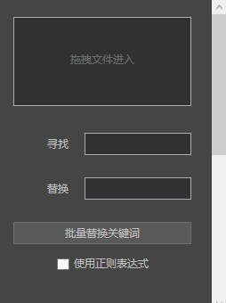
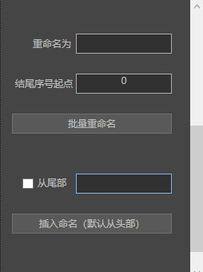

#   ReNmaer
  

  - 

  - 

#   介绍：

  1. 批量寻找替换名称关键字 支持正则表达式

  2. 批量重命名 支持自定义结尾序列号

  3. 批量从文件头部或尾部插入命名

# [  点我免费下载（适用于Window系统电脑）](https://github.com/PMZeroSkyline/WPF_ReNamer/raw/master/ReNamer/ReNamer/bin/Release/ReNamer.exe)

*本软件为一人开发 开源在GitHub 任何人都可以免费使用 没有广告 由 guzhang0@gamil.com 提供支持 欢迎错误反馈 欢迎到我的[ GitHub（点我进入） ](https://github.com/PMZeroSkyline)下载我的其它软件*

